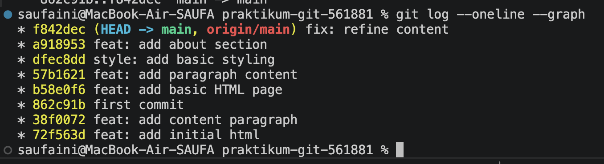

## Git log (Tugas 1)
* f842dec (HEAD -> main, origin/main) fix: refine content
* a918953 feat: add about section
* dfec8dd style: add basic styling
* 57b1621 feat: add paragraph content
* b58e0f6 feat: add basic HTML page
* 862c91b first commit
* 38f0072 feat: add content paragraph
* 72f563d feat: add initial html

## Git log (Tugas 2)
*   3a0ab0b (HEAD -> main, origin/main) Merge pull request #3 from saufaini/hotfix/typo
|\  
| * 69d59fd (origin/hotfix/typo, hotfix/typo) fix: correct typo in homepage
| *   b51b1e8 merge: resolve previous merge
| |\  
| * | bc1662f docs: update README
| * | fb6d885 docs: add git log screenshot
* | | 6c70f7d feat: add footer (#2)
* | | 1289e4b feat: add navbar (#1)
| |/  
|/|   
* | 0f24ed2 Update README.md
|/  